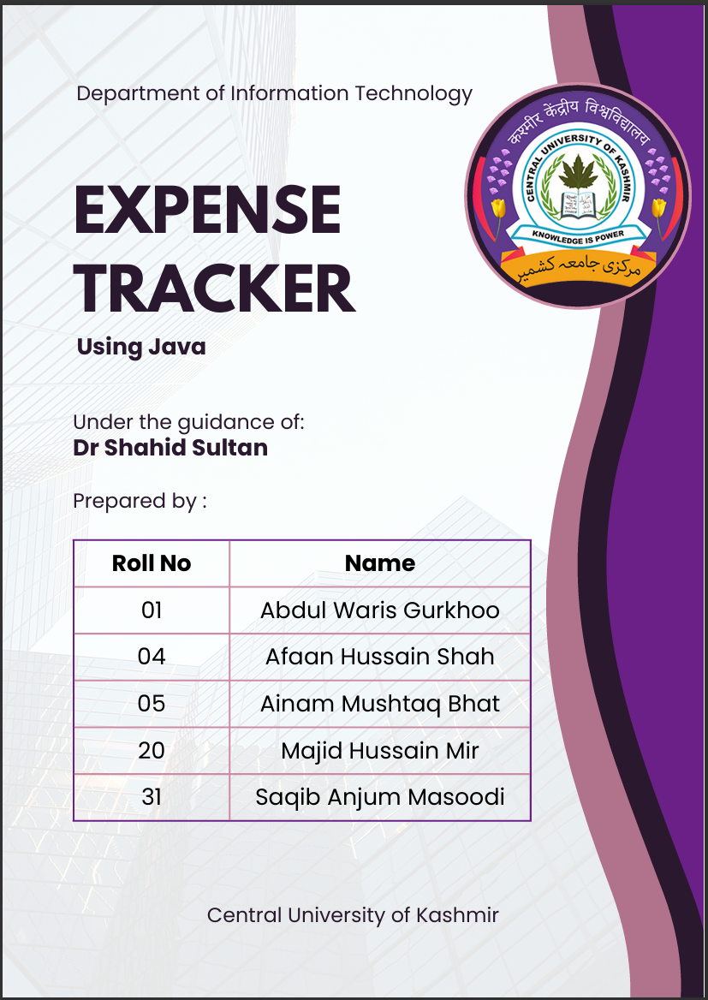

---

## 1. Objective

To design and implement a secure, multi-user application that allows individuals to log, categorize, and manage their daily expenses.

**Key Goals:**

* Build a responsive GUI using **Java AWT**.
* Ensure data isolation for multiple users using file-based storage.
* Implement the **MVC architectural pattern** for clean separation of concerns.

---

## 2. Tools & Technologies

| Technology | Purpose |
| --- | --- |
| **Java SE (17)** | Core programming language. |
| **Java AWT** | UI components and layout management. |
| **MVC Pattern** | Separation of data, view, and control layers. |
| **Collections API** | Sorting, storing, and retrieving data. |
| **java.io / NIO** | Persistent file-based storage (`users.txt` and `expenses_<user>.txt`). |

---

## 3. Application Architecture

The project is modularized to ensure maintainability:

* `Launcher.java`: Application entry point.
* `LoginWindow.java`: User authentication.
* `ExpenseTrackerView.java`: AWT GUI implementation.
* `ExpenseController.java`: Logic and event handling.
* `ExpenseModel.java`: Data handling and file I/O.
* `Expense.java`: Data model for individual entries.

---

## 4. Features

* **Auto-ID Generation:** Uses `System.nanoTime()` for unique record identification.
* **Dynamic Sorting:** Sort by amount, category, or date.
* **Batch Operations:** Select multiple rows via mouse click to delete.
* **Live Updates:** Total expense label updates dynamically.

---

## 5. Testing Summary

| Test Case | Action | Expected Result |
| --- | --- | --- |
| **TC1** | Login (New User) | New data file created |
| **TC2** | Add expense | Row added, total updated |
| **TC3** | Invalid amount | Error handling, no entry added |
| **TC4** | Click row | Row marked as selected |
| **TC5** | Remove Selected | Selected rows deleted |
| **TC6** | Sort by Category | Table reordered |

---

## 6. Future Scope

* **Graphical Reports:** Integration of pie charts or bar graphs.
* **Data Export:** Export records to CSV or PDF formats.
* **Database:** Migration to SQLite or MySQL.
* **Security:** Password-protected user accounts.

---

## 7. References

* [Oracle Java Documentation](https://docs.oracle.com)
* [GeeksforGeeks AWT Tutorials](https://www.geeksforgeeks.org)
* *Java: The Complete Reference* by Herbert Schildt

---

> **Note:** This is an offline tool; all data is stored locally on the user's machine.
<!-- Internal Draft: Final Review Complete -->
<!-- Draft: Final Review Complete -->
<!-- Draft: Final Review Complete -->
